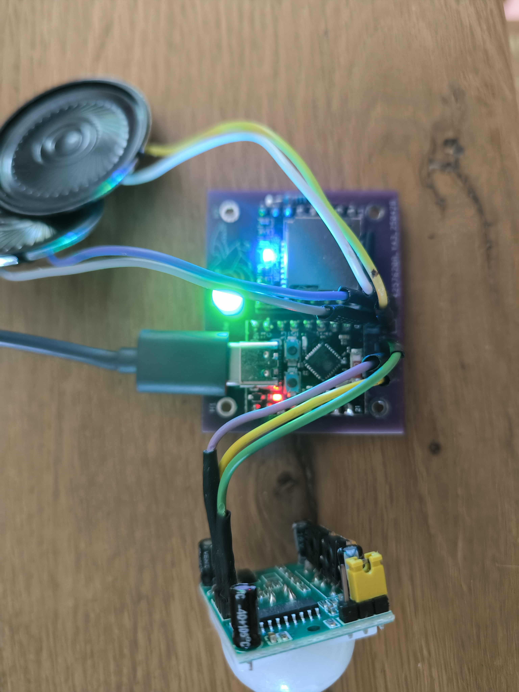
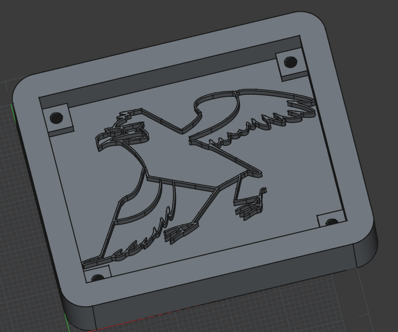
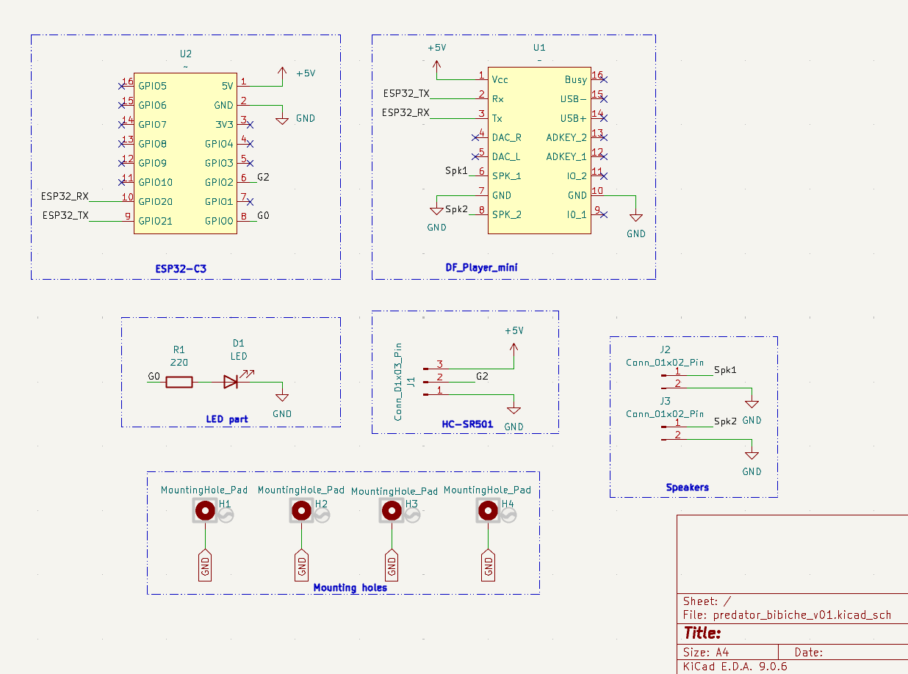
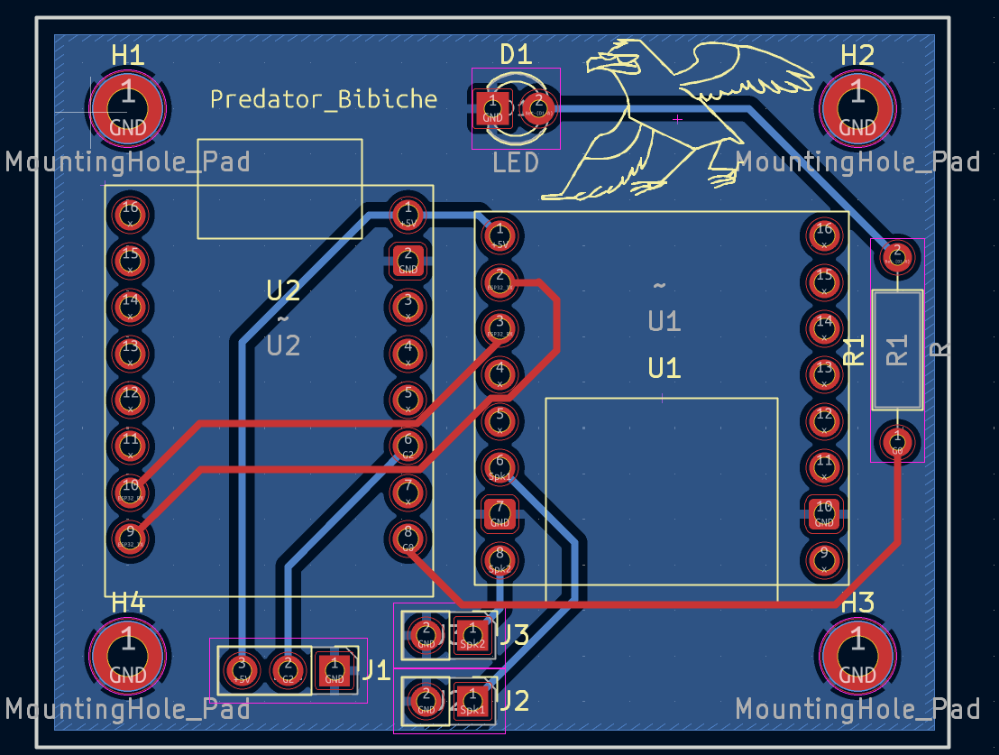

# Project Predator_mimicry

## Overview
<table align="center">
  <tr>
    <td align="center">
      <br/>
      <b>Full integrated prototype.</b>
    </td>
    <td align="center">
      <br/>
      <b>3D view of the casing.</b>
    </td>
  </tr>
</table>

## Concept
This system emits predator sounds upon motion detection. It integrates a green LED to facilitate sensitivity calibration by providing immediate visual feedback whenever an object is detected. To ensure optimal responsiveness, the primary action is handled within a callback function to avoid blocking the main execution loop. This implementation is based on the repository diagram originally developed by Lavron [https://github.com/lavron/micropython-dfplayermini/blob/master/DFPlayer-mini_ESP32_connection_diagram.png]


## Digital audio encoding techniques
For a deeper understanding of the signal processing involved, this external resource provides a comprehensive overview of digital audio encoding techniques and explains how sound is represented in digital systems. [https://www.hackster.io/Infineon_Team/silence-meet-signal-a-beginner-s-guide-to-pdm-microphones-dd4667]


## BOM
- ESP32-C3
- DFRobot DFPlayer mini
- PIR Motion Module (HC-SR501)
- LED


## Design
<table align="center">
  <tr>
    <td align="center">
      <br/>
      <b>Schematic diagram.</b>
    </td>
    <td align="center">
      <br/>
      <b>PCB layout.</b>
    </td>
  </tr>
</table>


## Ressources
https://github.com/lavron/micropython-dfplayermini


## Wiring

```
ESP32-C3    DFPlayer    Speaker     HC-SR501    LED
5V          Vcc
GND         GND                                 GND
G20         TX
G21         RX
            SPK1        Black
            SPK2        Red
G2                                  DAT
G0                                             220 Ohms
```

Don't forget to connect the RX/TX pins correctly, so the RX from one device should go to the TX of the other, and vice-versa [https://learn.sparkfun.com/tutorials/serial-communication/wiring-and-hardware].

NB: The connection via the 5V pins seems to be a bad idea according to the provider here [https://wiki.dfrobot.com/DFPlayer_Mini_SKU_DFR0299].
For the movement detection, inspiration can be found here [https://circuitdigest.com/microcontroller-projects/interface-hcsr501-pir-sensor-with-esp32].
Tune the distance sensitivity and time delay via screws driver head here [https://www.theengineeringprojects.com/2019/01/introduction-to-hc-sr501.html]


## Script
Copy the src folder to the ESP32 flashed with micropython firmware.

NB: The order you copy the mp3 into micro SD card will affect the order mp3 played, which means play(1) function will play the first mp3 copied into micro SD card. The syntax of folder/filename is important. Please keep the following structure:

```
tree .
```
should returns:

```
.
└── 01
    ├── 001.mp3
    └── 002.mp3

2 directories, 2 files

```


